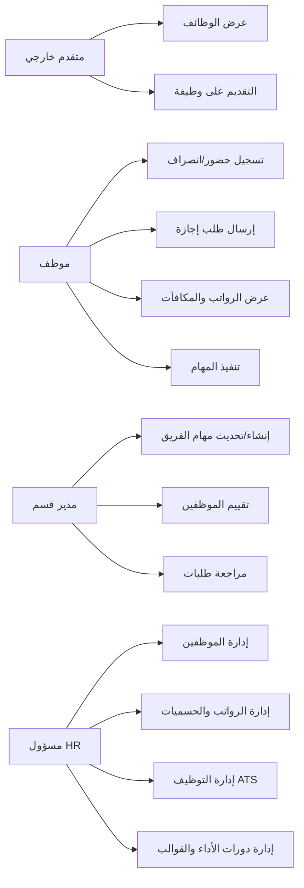
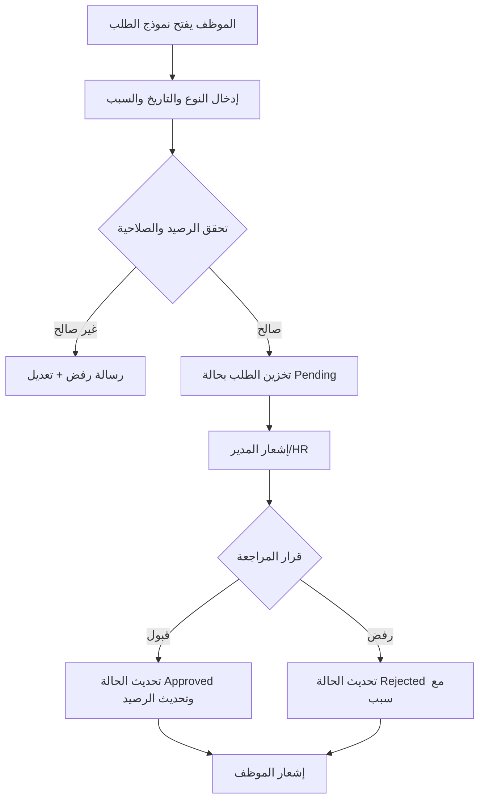
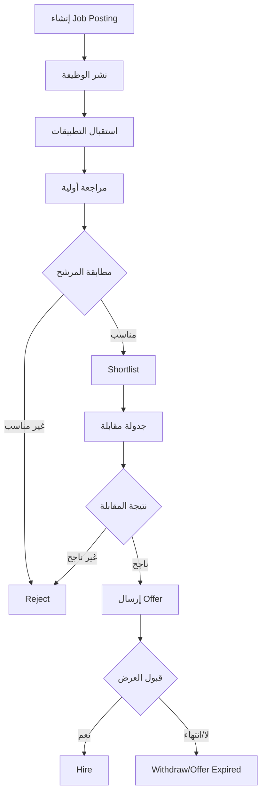
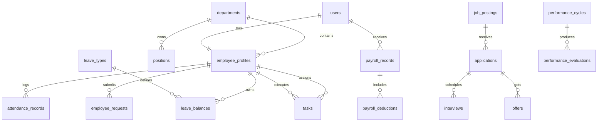
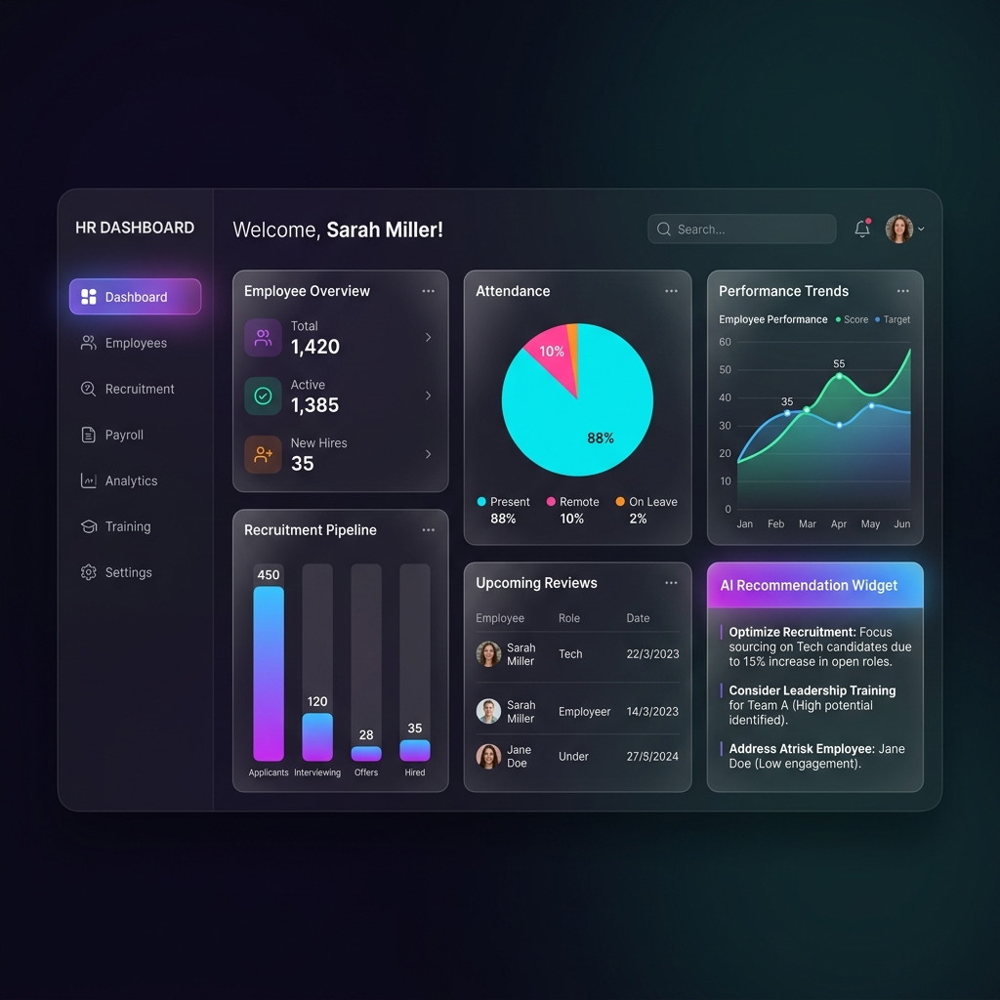

# توثيق مشروع Huma-HR

> هذا المستند يوثّق مشروع **Huma-HR** وفق الفصول المطلوبة في منهجية التوثيق المرفقة.

---

## ملاحظات تنسيقية حسب المنهجية المرفقة
- لغة التوثيق: العربية مع الإبقاء على المصطلحات التقنية بالإنجليزية.
- حجم الصفحة المستهدف عند التحويل لـ Word/PDF: **A4**.
- خطوط مقترحة:
  - العربية: **Simplified Arabic** بحجم 13.5
  - الإنجليزية: **Times New Roman** بحجم 12
  - عناوين الفصول: 16 غامق
  - العناوين الرئيسية: 14.5 غامق
  - العناوين الفرعية: 14 غامق

---

# الفصل الأول - تمهيد المشروع

## 1.1 مقدمة
Huma-HR هو نظام إدارة موارد بشرية متكامل يدعم الرقمنة الكاملة لعمليات شؤون الموظفين، ويجمع بين إدارة الموظفين، الرواتب، الإجازات، الحضور، التوظيف (ATS)، وإدارة الأداء ضمن منصة موحّدة.

## 1.2 مشكلة المشروع
العمل اليدوي في أقسام الموارد البشرية يسبب:
- بطء في إنجاز العمليات الإدارية.
- تشتت البيانات بين ملفات وأنظمة متعددة.
- صعوبة تتبّع مؤشرات الأداء واتخاذ القرار بسرعة.
- ارتفاع احتمالية الأخطاء البشرية في الرواتب والإجازات.

## 1.3 أهداف المشروع
- أتمتة عمليات الموارد البشرية الأساسية في منصة واحدة.
- تحسين دقة البيانات وتقليل الأخطاء التشغيلية.
- تسريع دورة التوظيف من نشر الوظيفة إلى التعيين.
- تمكين تقييم أداء دوري مبني على مؤشرات واضحة.
- دعم صلاحيات متعددة حسب الدور الوظيفي.

## 1.4 مبررات المشروع
- الحاجة لنظام قابل للتوسع بدل الحلول المجزأة.
- وجود مهام متكررة يمكن أتمتتها (طلبات، موافقات، تنبيهات).
- ضرورة وجود تقارير تشغيلية تدعم القرار الإداري.

## 1.5 أهمية المشروع
- رفع كفاءة إدارة الموارد البشرية.
- توفير تجربة موحدة للموظف وHR والمدير.
- تحسين الشفافية في التقييمات والترقيات والمكافآت.
- توفير أساس تقني قابل للتطوير مستقبلًا (AI/تحليلات أعمق).

## 1.6 مشاريع مشابهة
- BambooHR
- Zoho People
- SAP SuccessFactors
- Odoo HR

التميّز في Huma-HR: دمج ATS + إدارة الأداء + الرواتب + بوابة الموظف ضمن بنية واحدة قابلة للتخصيص.

---

# الفصل الثاني - تحليل النظام

## 2.1 مقدمة
يركز هذا الفصل على حدود النظام، الخدمات المقدمة، أنواع المستخدمين، وتمثيل التدفقات الوظيفية الأساسية.

## 2.2 نطاق النظام
يشمل النظام:
- إدارة بيانات الموظفين والأقسام والمناصب.
- إدارة الحضور وربطه بمواقع العمل (Geofencing).
- إدارة الإجازات والطلبات والموافقات.
- إدارة الرواتب والحسميات والمكافآت.
- إدارة التوظيف من إعلان الوظائف إلى المقابلات والعروض.
- إدارة الأداء (مهام، تقييم مدير، تقييم أقران، نتائج دورات الأداء).

لا يشمل حاليًا:
- إدارة مالية محاسبية خارج نطاق الموارد البشرية.
- تكامل رسمي موثق مع ERP خارجي.

## 2.3 الخدمات التي يقدمها النظام
1. **Authentication & Authorization** (Laravel Sanctum + Roles).
2. **Employee Management** (ملفات الموظفين والحركات الوظيفية).
3. **Department & Org Chart** (هيكل تنظيمي ومناصب).
4. **Attendance Management** (حضور، انصراف، اتجاهات).
5. **Leave & Requests Management** (أنواع الإجازات والأرصدة والطلبات).
6. **Payroll Management** (تهيئة رواتب شهرية، دفع، تراجع، حسميات/إضافات).
7. **Recruitment/ATS** (وظائف، طلبات، مقابلات، عروض، توظيف).
8. **Performance Management** (دورات تقييم، مهام، مراجعات، إجراءات).
9. **Employee Portal** (الملف الشخصي، الرواتب، المكافآت، المحادثات، الإشعارات).

## 2.4 أنواع المستخدمين
- **HR**: إدارة شاملة (موظفين، رواتب، توظيف، تقييم أداء).
- **Department Manager / Manager**: إدارة الفريق والمهام والتقييمات.
- **Employee**: استخدام بوابة الموظف (طلبات، حضور، مهام، ملف شخصي).
- **Public Candidate**: التقديم على الوظائف المنشورة.

## 2.5 مخططات Use Case للخدمات


## 2.6 مخططات Activity للخدمات
### 2.6.1 Activity Diagram - طلب إجازة


### 2.6.2 Activity Diagram - دورة التوظيف (ATS)


---

# الفصل الثالث - تصميم وتحقيق النظام

## 3.1 مقدمة
يعرض هذا الفصل البنية الفنية للنظام، طبقاته، قاعدة البيانات، والتقنيات المستخدمة في التنفيذ.

## 3.2 معمارية النظام (شكل رسومي)
```mermaid
flowchart LR
  U[Users: HR / Manager / Employee / Candidate] --> FE[FrontEnd - React + Vite]
  FE -->|REST API + ****** BE[BackEnd - Laravel 12]
  BE --> AUTH[Sanctum + Spatie Roles]
  BE --> SRV[Business Services\nATS/Payroll/Performance]
  SRV --> DB[(MySQL/SQLite عبر Eloquent)]
  BE --> FS[Storage: ملفات السير الذاتية والمرفقات]
```

## 3.3 توصيف قاعدة البيانات مع مخطط
### 3.3.1 أهم الكيانات
- **users**: حسابات الدخول.
- **employee_profiles**: بيانات الموظف الأساسية والوظيفية.
- **departments / positions**: الهيكل التنظيمي.
- **attendance_records**: سجلات الحضور والانصراف.
- **leave_types / leave_balances / employee_requests**: إدارة الإجازات والطلبات.
- **payroll_records / payroll_deductions / salary_structures**: الرواتب والحسميات.
- **job_postings / applications / interviews / offers**: دورة التوظيف.
- **tasks / performance_cycles / performance_evaluations**: إدارة الأداء.

### 3.3.2 مخطط مبسط (ER Diagram)


## 3.4 الأدوات والتقنيات المستخدمة
### BackEnd
- PHP 8.2
- Laravel 12
- Laravel Sanctum (Token Auth)
- Spatie Laravel Permission (RBAC)
- Eloquent ORM + Migrations
- PHPUnit للاختبارات

### FrontEnd
- React 19
- Vite 7
- Redux Toolkit
- React Router
- Axios
- Bootstrap + CSS
- Recharts (رسوم بيانية)

## 3.5 توصيف الواجهة الخلفية (Back End)
- تعتمد على RESTful API ضمن `BackEnd/routes/api.php`.
- حماية المسارات عبر `auth:sanctum` و`role middleware`.
- تنظيم العمل على Controllers + Services (مثل ATS وPerformance).
- دعم حالات الأعمال (طلبات الإجازة، حالات التوظيف، حالات المهام، حالات دورة الأداء).
- استخدام Migrations وSeeders لبناء بيانات أولية (الأدوار، بيانات أساسية للرواتب والمكاتب).

## 3.6 توصيف الواجهة الأمامية (Front End)
- React SPA مع فصل واضح بين صفحات HR وبوابة الموظف.
- `ProtectedRoute` للتحقق من التوكن والدور قبل السماح بالوصول.
- وحدات رئيسية: Dashboard، إدارة الموظفين، الرواتب، التوظيف، التقارير، الأداء.
- دعم لغات/تهيئة i18n وواجهات تفاعلية للتقارير والمخططات.

### صور الواجهات الأساسية
#### واجهة عامة/هوية النظام


#### نموذج Dashboard (واجهة HR)


> ملاحظة: يُفضّل في النسخة النهائية للتقرير إضافة لقطات تشغيل فعلية من الصفحات التالية: إدارة الموظفين، الرواتب الشهرية، التوظيف، الأداء، وبوابة الموظف.

## 3.7 تشغيل المشروع (صور وشرح سريع)
### 3.7.1 تشغيل BackEnd
```bash
cd /home/runner/work/Huma-HR/Huma-HR/BackEnd
composer install
cp .env.example .env
php artisan key:generate
php artisan migrate --seed
php artisan serve
```

### 3.7.2 تشغيل FrontEnd
```bash
cd /home/runner/work/Huma-HR/Huma-HR/FrontEnd
npm install
npm run dev
```

### 3.7.3 ملاحظات التشغيل
- واجهة API تعتمد على Laravel API routes.
- يجب التأكد من إعدادات CORS و`API_BASE_URL` في الواجهة الأمامية.

---

# الفصل الرابع - الاختبار والتقييم

## 4.1 إعداد بيئة الاختبار
- بيئة Laravel Test مع `php artisan test`.
- قاعدة بيانات اختبارية مع `RefreshDatabase` في اختبارات الوحدة.
- تشغيل الاختبارات من مجلد `BackEnd`.

## 4.2 خطة الاختبار (جدول حالات الاختبار)
| رقم | الحالة | الإدخال | المتوقع |
|---|---|---|---|
| TC-01 | تسجيل دخول صحيح | بريد/كلمة مرور صحيحة | إنشاء توكن وتوجيه حسب الدور |
| TC-02 | تسجيل دخول خاطئ | بيانات غير صحيحة | رسالة 401 |
| TC-03 | إنشاء طلب إجازة | نوع إجازة + تاريخ | تخزين الطلب Pending |
| TC-04 | اعتماد/رفض طلب | قرار HR/Manager | تحديث الحالة وإشعار الموظف |
| TC-05 | إنشاء مسير رواتب | شهر/سنة | إنشاء سجلات payroll |
| TC-06 | دفع راتب | Payroll ID | تحديث Paid + إشعار |
| TC-07 | التقديم على وظيفة | بيانات مرشح + CV | إنشاء Application بالحالة Pending |
| TC-08 | تقييم مهمة | Completion + Quality | حساب درجة نهائية صحيحة |

## 4.3 اختبار الوحدة، التكامل، والأداء
- **Unit Tests موجودة فعليًا** في:
  - `tests/Unit/PerformanceTest.php`
  - `tests/Unit/TaskPerformanceTest.php`
- **تكامل**: تحقق ترابط API مع قاعدة البيانات (Auth, Payroll, ATS, Performance).
- **أداء**: تقييم استجابة صفحات التقارير والاستعلامات الثقيلة (يوصى بقياسات زمنية في البيئة الإنتاجية).

## 4.4 نتائج الاختبار والأخطاء التي ظهرت
- الاختبارات المتوفرة تغطي:
  - صحة مدد دورات الأداء.
  - صحة أوزان مكونات التقييم.
  - دقة احتساب درجات المهام الفردية والتجميعية.
- أخطاء متوقعة أثناء الدمج غالبًا تكون:
  - أخطاء صلاحيات الدور.
  - عدم تزامن حالات الطلب/المهمة.
  - اختلاف إعدادات البيئة بين FrontEnd وBackEnd.

## 4.5 التكرار والتحسين
- تحسين التغطية الاختبارية لتشمل سيناريوهات API End-to-End.
- إضافة اختبارات للـ ATS Workflow (Interview → Offer → Hire).
- تحسين اختبارات الأداء للاستعلامات الإحصائية.

## 4.6 ملاحظات وتوصيات حول الاختبارات
- اعتماد مجموعة بيانات Seed ثابتة لسهولة إعادة الاختبار.
- إضافة CI pipeline للاختبارات التلقائية عند كل Push.
- توسيع اختبارات الأمان (Auth, Roles, Input Validation).

---

# الفصل الخامس - المناقشة والتحديات

## 5.1 تحليل النتائج مقارنة بالأهداف
- تم تحقيق الهدف الأساسي: منصة HR موحّدة متعددة الوحدات.
- تحققت أتمتة جزئية/كبيرة في الطلبات، التوظيف، والرواتب والتقييم.
- ما يزال مجال التحسين قائمًا في الأتمتة التحليلية العميقة والتكاملات الخارجية.

## 5.2 تقييم جودة النظام
- **الدقة**: جيدة بسبب الاعتماد على قيود قاعدة البيانات والتحقق في الـ backend.
- **الأمان**: جيد مبدئيًا (Sanctum + RBAC)، ويحتاج تعزيزًا بفحوص أمنية دورية.
- **سهولة الاستخدام**: جيدة بفضل تقسيم الواجهات حسب الدور.

## 5.3 ما تم تحقيقه مقابل المخطط
- المنجز: إدارة موظفين، رواتب، حضور، إجازات، ATS، أداء.
- المؤجل/القابل للتحسين: توسعة الاختبارات التكاملية، مؤشرات أداء أعمق، تقارير تنفيذية أكثر ذكاءً.

## 5.4 التحديات وكيف تم التعامل معها
- **تعقيد الصلاحيات**: عولج عبر أدوار متعددة وMiddleware.
- **ترابط الوحدات**: عولج بالفصل بين Controllers وServices ونماذج واضحة.
- **اختلاف حالات الأعمال**: عولج عبر Enums/Statuses محددة للتدفق.

## 5.5 قابلية التوسعة مستقبلاً
- إضافة وحدات جديدة (Onboarding، Training، KPI متقدم).
- تكامل مع خدمات خارجية (ERP، البريد المؤسسي، SSO).
- توسيع الذكاء الاصطناعي في الفرز والتوصيات.

---

# الفصل السادس - الخاتمة والتوصيات

قدّم مشروع Huma-HR أساسًا قويًا لنظام موارد بشرية متكامل يجمع الوظائف التشغيلية الأساسية ضمن بنية تقنية حديثة. تم تحقيق جزء كبير من أهداف الأتمتة والتنظيم وتحسين الوصول للمعلومة لكل من HR والموظف والمدير.

**محدوديات حالية:**
- الحاجة إلى تغطية اختبارية أوسع على مستوى التكامل والأداء.
- الحاجة إلى لقطات تشغيل كاملة ومقاييس ميدانية من بيئة فعلية.

**الآفاق المستقبلية:**
- تعزيز التحليلات الذكية ومؤشرات القرار.
- دعم تكاملات خارجية أوسع.
- رفع مستوى النضج التشغيلي عبر CI/CD ومراقبة الأداء.

---

# المراجع
> تم توثيق المراجع داخل النص بالأرقام [1] [2] ...

[1] Laravel Documentation: https://laravel.com/docs

[2] Laravel Sanctum Documentation: https://laravel.com/docs/sanctum

[3] Spatie Laravel Permission: https://spatie.be/docs/laravel-permission

[4] React Documentation: https://react.dev

[5] Vite Documentation: https://vite.dev/guide/

[6] Mermaid Documentation: https://mermaid.js.org

[7] PHPUnit Documentation: https://phpunit.de/documentation.html

---

# الملاحق (اختياري)
## ملحق A - مواقع الملفات المرجعية داخل المشروع
- BackEnd API Routes:
  - `/home/runner/work/Huma-HR/Huma-HR/BackEnd/routes/api.php`
- FrontEnd Routing:
  - `/home/runner/work/Huma-HR/Huma-HR/FrontEnd/src/App.jsx`
- نماذج قاعدة البيانات:
  - `/home/runner/work/Huma-HR/Huma-HR/BackEnd/app/Models`
- Migration Files:
  - `/home/runner/work/Huma-HR/Huma-HR/BackEnd/database/migrations`

## ملحق B - ملاحظة للإخراج النهائي الأكاديمي
يفضل نسخ هذا المحتوى إلى ملف Word وتطبيق تنسيقات الخطوط والأحجام والترقيم المطلوبة في منهجية الكلية قبل التسليم النهائي.
